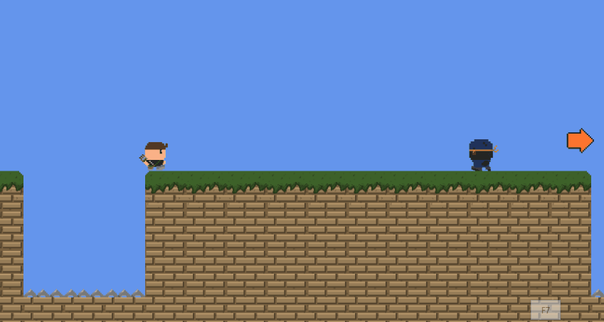

# WheresAnne

A game made by awful dev students.

**GAME**

Dir -> playAnneGame\bin\Windows\x86\Debug

**CREDITS**

Blake Leroy (Art/Programmer), Michael Cattermole (Programmer), Daniel Ivry (Programmer).

**GRADE** 

First Class (72)

**NOTE!** 

The official OST is not included in the actual game.

 **the official OST for Where's Anne, made 6 years later!**

 

 **wait, was that..?**

 

 **it looks easy, until it isn't...**

 

